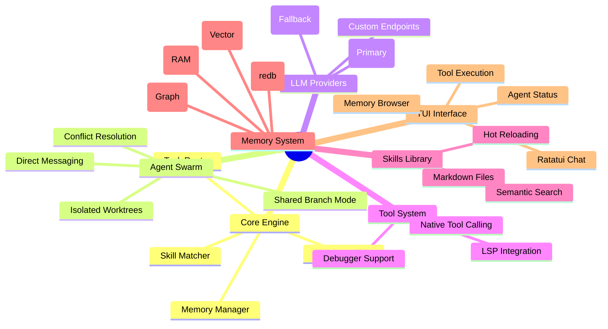
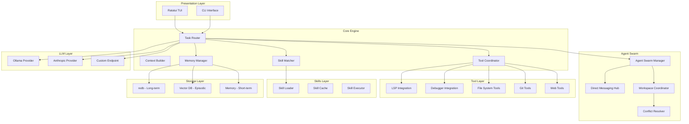
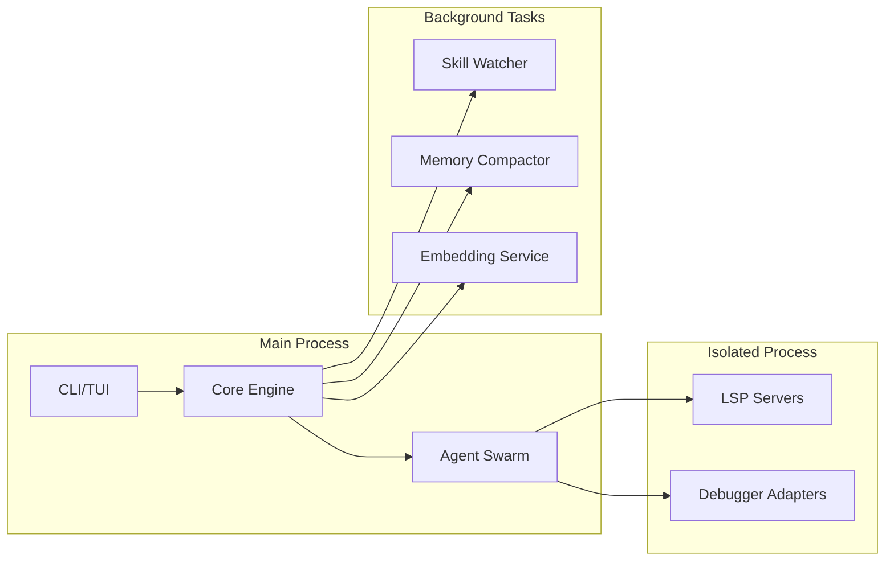
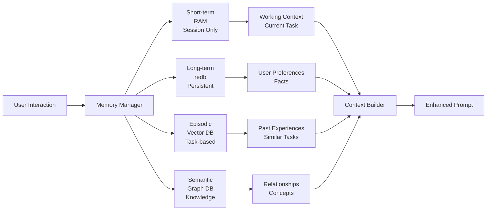

# 📐 KOD Specification Document

**Version:** 1.0.0  
**Status:** Draft  
**Project:** kod — High-Performance AI Coding Agent Harness  
**License:** MIT  

---

## 🎯 1. Executive Summary

KOD is a terminal-native, high-performance AI coding agent harness built in Rust. It combines:

- **jcode-inspired performance** — minimal RAM footprint, zero-copy parsing, aggressive caching
- **oh-my-pi coding capabilities** — LSP integration, debugger support, hash-anchored edits
- **Markdown-based skills system** — reusable knowledge assets in `~/.kod/skills/`
- **Autonomous agent swarms** — coordinated agents with direct messaging, shared branch collaboration, optional worktree isolation
- **Local LLM execution** — Ollama-first architecture with multi-provider fallback

The system is architected for developers who need **terminal-native AI assistance with deep code understanding**, multi-agent collaboration, and complete control over their AI tooling.



---

## 🏗️ 2. System Architecture

### 2.1 High-Level Architecture



### 2.2 Process Architecture



---

## 📦 3. Technology Stack Rationale

### 3.1 Core Dependencies

| Dependency | Version | Purpose | Rationale |
|-----------|---------|---------|-----------|
| `serde` | 1.0.229 | Serialization | Industry standard, zero-cost abstractions |
| `tokio` | 1.52.3 | Async runtime | Multi-threaded, io-uring support, mature ecosystem |
| `reqwest` | 0.13.4 | HTTP client | Async, rustls TLS (no OpenSSL), streaming support |
| `compact_str` | 0.10.0 | String optimization | Inline storage for small strings, reduces allocations |
| `slotmap` | 1.1.1 | Key-value storage | Stable keys, better cache locality than HashMap |
| `arc-swap` | 1.9.2 | Atomic swapping | Lock-free reads for shared state |
| `redb` | 4.1.0 | Embedded database | ACID transactions, LMDB-like performance, pure Rust |
| `fastembed` | 5.17.4 | Embeddings | ONNX runtime, no Python dependency, fast inference |

### 3.2 Architecture Constraints

```rust
// constraint.rs
pub struct ArchitectureConstraints {
    /// Maximum memory for 100 skills
    pub max_skill_memory: ByteSize,      // 50MB
    /// Maximum memory for base system
    pub max_base_memory: ByteSize,       // 150MB
    /// Target cold start time
    pub max_startup_time: Duration,      // 800ms
    /// Target response time for simple tasks
    pub max_simple_response: Duration,   // 200ms
    /// Target agent spawn time
    pub max_agent_spawn: Duration,       // 100ms
}

impl Default for ArchitectureConstraints {
    fn default() -> Self {
        Self {
            max_skill_memory: ByteSize::mib(50),
            max_base_memory: ByteSize::mib(150),
            max_startup_time: Duration::from_millis(800),
            max_simple_response: Duration::from_millis(200),
            max_agent_spawn: Duration::from_millis(100),
        }
    }
}
```

---

## 🧩 4. Core Modules Specification

### 4.1 Module Structure

```
kod/
├── Cargo.toml              # Workspace
├── crates/
│   ├── kod-core/          # Core engine, task routing
│   ├── kod-skills/        # Markdown skill system
│   ├── kod-memory/        # Memory management
│   ├── kod-swarm/         # Agent swarm coordination
│   ├── kod-tools/         # Tool calling infrastructure
│   ├── kod-lsp/           # LSP integration (optional)
│   ├── kod-debug/         # Debugger integration (optional)
│   ├── kod-tui/           # Ratatui interface
│   ├── kod-cli/           # CLI interface
│   ├── kod-provider/      # LLM provider abstraction
│   │   ├── kod-provider-ollama/
│   │   └── kod-provider-anthropic/
│   └── kod-embed/         # Embedding service (isolated, heavy)
└── docs/
```

### 4.2 Core Engine (`kod-core`)

```rust
// lib.rs
pub mod task_router;
pub mod context_builder;
pub mod config;
pub mod error;

pub use task_router::TaskRouter;
pub use context_builder::ContextBuilder;
pub use config::KodConfig;
pub use error::{KodError, Result};

#[derive(Debug, Clone)]
pub struct KodConfig {
    pub llm: LlmConfig,
    pub swarm: SwarmConfig,
    pub memory: MemoryConfig,
    pub skills: SkillsConfig,
    pub ui: UiConfig,
}

#[derive(Debug, Clone)]
pub struct LlmConfig {
    pub provider: ProviderType,
    pub model: String,
    pub fallback_providers: Vec<ProviderType>,
    pub context_window: usize,
    pub max_tokens: usize,
}

#[derive(Debug, Clone, Serialize, Deserialize)]
pub enum ProviderType {
    Ollama {
        base_url: String,
        model: String,
    },
    Anthropic {
        api_key: Option<String>,
        model: String,
    },
    Custom {
        endpoint: String,
        model: String,
    },
}

pub struct TaskRouter {
    config: Arc<KodConfig>,
    skill_matcher: SkillMatcher,
    memory_manager: MemoryManager,
    swarm_manager: AgentSwarm,
    tool_coordinator: ToolCoordinator,
}

impl TaskRouter {
    pub async fn process_input(&self, input: &UserInput) -> Result<TaskResponse> {
        // 1. Classify task
        let classification = self.classify_task(input).await?;
        
        // 2. Retrieve relevant context from memory
        let memory_context = self.memory_manager
            .retrieve_context(&input.content)
            .await?;
        
        // 3. Match relevant skills
        let skills = self.skill_matcher
            .find_relevant_skills(&input.content, &memory_context)
            .await?;
        
        // 4. Build context
        let context = self.context_builder
            .build_context(input, memory_context, skills)
            .await?;
        
        // 5. Route to appropriate handler
        match classification {
            TaskType::Simple => self.handle_simple(context).await,
            TaskType::Complex => self.handle_complex_with_swarm(context).await,
            TaskType::CodeModification => self.handle_code_modification(context).await,
            TaskType::Debugging => self.handle_debugging(context).await,
            TaskType::Research => self.handle_research(context).await,
        }
    }
}
```

<details>
<summary>📖 Task Classification Logic</summary>

```rust
pub enum TaskType {
    Simple,           // Quick questions, lookups
    Complex,          // Multi-step, requires swarm
    CodeModification, // File edits, refactoring
    Debugging,        // Error analysis, breakpoints
    Research,         // Documentation, web search
}

impl TaskRouter {
    async fn classify_task(&self, input: &UserInput) -> Result<TaskType> {
        // Pattern-based classification
        let patterns = [
            (r"\b(fix|debug|error|traceback|exception)\b", TaskType::Debugging),
            (r"\b(refactor|rename|move|extract|inline)\b", TaskType::CodeModification),
            (r"\b(implement|create|build|write|generate)\b.*\b(function|class|module|feature)\b", TaskType::CodeModification),
            (r"\b(research|find|search|look up|investigate)\b", TaskType::Research),
            (r"\b(analyze|architect|design|plan)\b.*\b(complex|system|multi|several)\b", TaskType::Complex),
        ];
        
        for (pattern, task_type) in &patterns {
            if Regex::new(pattern)?.is_match(&input.content) {
                return Ok(task_type.clone());
            }
        }
        
        // Default to simple
        Ok(TaskType::Simple)
    }
}
```
</details>

---

## 📚 5. Skills System Specification (`kod-skills`)

### 5.1 Skill File Format

```markdown
---
name: rust-refactoring
description: Rust code refactoring with LSP integration
version: 1.2.0
author: kod-team
category: coding
tags: [rust, refactoring, lsp]
capabilities:
  - code-refactoring
  - symbol-rename
  - reference-finding
requirements:
  - rust-analyzer
  - cargo
triggers:
  - "refactor rust"
  - "rename symbol"
  - "rust code structure"
---

# Rust Refactoring Skill

## Instructions

You are an expert Rust refactoring assistant. When activated:

1. **Analyze the code structure** using LSP tools
2. **Identify refactoring opportunities** based on Rust idioms
3. **Propose changes** with explanations
4. **Apply changes** using hash-anchored edits
5. **Verify changes** don't break references

## Code Style Guidelines

- Prefer `impl Trait` over generics where applicable
- Use `Result<T, E>` for fallible operations
- Follow Rust naming conventions (snake_case, CamelCase)
- Add docstrings for public items
- Consider ownership and borrowing implications

## Examples

<example input="Refactor this function to use iterators">
Before:
```rust
fn sum_numbers(nums: &Vec<i32>) -> i32 {
    let mut sum = 0;
    for num in nums {
        sum += num;
    }
    sum
}
```

After:
```rust
fn sum_numbers(nums: &[i32]) -> i32 {
    nums.iter().sum()
}
```
</example>

## Constraints

- Never change public API without explicit request
- Preserve existing tests
- Maintain backward compatibility when possible
- Warn about breaking changes
```

### 5.2 Skill Loader Implementation

```rust
// loader.rs
use std::path::{Path, PathBuf};
use notify::{Watcher, RecursiveMode, Event as NotifyEvent};
use tokio::sync::{mpsc, RwLock};
use walkdir::WalkDir;

pub struct SkillLoader {
    skills_dir: PathBuf,
    cache: Arc<RwLock<HashMap<SkillId, Skill>>>,
    watcher: Option<notify::RecommendedWatcher>,
    hot_reload: bool,
}

impl SkillLoader {
    pub async fn new(skills_dir: PathBuf) -> Result<Self> {
        let cache = Arc::new(RwLock::new(HashMap::new()));
        
        // Initial load
        let loader = Self {
            skills_dir: skills_dir.clone(),
            cache: cache.clone(),
            watcher: None,
            hot_reload: true,
        };
        
        loader.load_all_skills().await?;
        
        // Set up hot reloading if enabled
        if loader.hot_reload {
            loader.setup_watcher()?;
        }
        
        Ok(loader)
    }
    
    async fn load_all_skills(&self) -> Result<()> {
        let mut loaded_count = 0;
        
        for entry in WalkDir::new(&self.skills_dir)
            .follow_links(true)
            .into_iter()
            .filter_map(|e| e.ok())
            .filter(|e| e.path().extension().and_then(|s| s.to_str()) == Some("md"))
        {
            if let Ok(skill) = self.load_skill(entry.path()).await {
                let mut cache = self.cache.write().await;
                cache.insert(skill.id.clone(), skill);
                loaded_count += 1;
            }
        }
        
        tracing::info!("Loaded {} skills from {:?}", loaded_count, self.skills_dir);
        Ok(())
    }
    
    async fn load_skill(&self, path: &Path) -> Result<Skill> {
        let content = tokio::fs::read_to_string(path).await?;
        
        // Parse YAML front matter
        let (metadata, body) = Self::parse_front_matter(&content)?;
        
        // Extract instructions
        let instructions = Self::extract_section(&body, "## Instructions");
        
        // Extract examples
        let examples = Self::extract_examples(&body);
        
        // Extract constraints
        let constraints = Self::extract_section(&body, "## Constraints");
        
        Ok(Skill {
            id: SkillId::new(&metadata.name),
            metadata,
            instructions,
            examples,
            constraints,
            content: body,
            path: path.to_path_buf(),
            loaded_at: std::time::Instant::now(),
        })
    }
    
    fn parse_front_matter(content: &str) -> Result<(SkillMetadata, String)> {
        // Split at "---" markers
        let parts: Vec<&str> = content.splitn(3, "---").collect();
        if parts.len() < 3 {
            return Err(KodError::SkillParseError("Missing front matter".into()));
        }
        
        let metadata: SkillMetadata = serde_yaml::from_str(parts[1].trim())?;
        let body = parts[2].trim().to_string();
        
        Ok((metadata, body))
    }
    
    fn setup_watcher(&mut self) -> Result<()> {
        let (tx, mut rx) = mpsc::unbounded_channel();
        
        let mut watcher = notify::recommended_watcher(move |res| {
            if let Ok(event) = res {
                let _ = tx.send(event);
            }
        })?;
        
        watcher.watch(&self.skills_dir, RecursiveMode::Recursive)?;
        
        // Spawn hot reload task
        let cache = self.cache.clone();
        let skills_dir = self.skills_dir.clone();
        
        tokio::spawn(async move {
            while let Some(event) = rx.recv().await {
                if let NotifyEvent::Modify(_) | NotifyEvent::Create(_) = event.kind {
                    // Reload affected skills
                    for path in &event.paths {
                        if path.extension().and_then(|s| s.to_str()) == Some("md") {
                            if let Ok(skill) = load_skill_sync(path, &skills_dir) {
                                let mut cache_guard = cache.write().await;
                                cache_guard.insert(skill.id.clone(), skill);
                                tracing::debug!("Reloaded skill: {:?}", path);
                            }
                        }
                    }
                }
            }
        });
        
        self.watcher = Some(watcher);
        Ok(())
    }
    
    pub async fn get_skill(&self, id: &SkillId) -> Option<Skill> {
        self.cache.read().await.get(id).cloned()
    }
    
    pub async fn search_skills(&self, query: &str) -> Vec<Skill> {
        let cache = self.cache.read().await;
        cache.values()
            .filter(|skill| {
                skill.metadata.name.to_lowercase().contains(&query.to_lowercase()) ||
                skill.metadata.description.to_lowercase().contains(&query.to_lowercase()) ||
                skill.metadata.tags.iter().any(|t| t.contains(query))
            })
            .cloned()
            .collect()
    }
}
```

### 5.3 Skill Matcher

```rust
// matcher.rs
pub struct SkillMatcher {
    loader: Arc<SkillLoader>,
    embedding_service: Option<EmbeddingService>,
    match_threshold: f32,
}

impl SkillMatcher {
    pub async fn find_relevant_skills(
        &self,
        input: &str,
        context: &MemoryContext,
    ) -> Result<Vec<Skill>> {
        let mut scored_skills = Vec::new();
        
        // 1. Pattern-based matching (fast, no embeddings)
        for skill in self.loader.get_all_skills().await {
            let score = self.pattern_match_score(&skill, input);
            if score > 0.5 {
                scored_skills.push((skill, score));
            }
        }
        
        // 2. Semantic matching (slower, requires embeddings)
        if let Some(embedding_service) = &self.embedding_service {
            let input_embedding = embedding_service.embed(input).await?;
            
            for skill in self.loader.get_all_skills().await {
                if let Some(skill_embedding) = skill.embedding.clone() {
                    let similarity = cosine_similarity(&input_embedding, &skill_embedding);
                    if similarity > self.match_threshold {
                        // Update score with semantic similarity
                        if let Some(existing) = scored_skills.iter_mut()
                            .find(|(s, _)| s.id == skill.id) 
                        {
                            existing.1 = (existing.1 + similarity) / 2.0;
                        } else {
                            scored_skills.push((skill, similarity));
                        }
                    }
                }
            }
        }
        
        // 3. Context-based matching
        for skill in self.loader.get_all_skills().await {
            let context_score = self.context_match_score(&skill, context);
            if context_score > 0.3 {
                if let Some(existing) = scored_skills.iter_mut()
                    .find(|(s, _)| s.id == skill.id) 
                {
                    existing.1 = (existing.1 + context_score) / 2.0;
                } else {
                    scored_skills.push((skill, context_score));
                }
            }
        }
        
        // Sort by score, descending
        scored_skills.sort_by(|a, b| b.1.partial_cmp(&a.1).unwrap());
        
        // Return top N skills
        Ok(scored_skills.into_iter()
            .take(3)  // Limit to top 3 skills per query
            .map(|(skill, _)| skill)
            .collect())
    }
    
    fn pattern_match_score(&self, skill: &Skill, input: &str) -> f32 {
        let mut score = 0.0;
        let input_lower = input.to_lowercase();
        
        // Check triggers
        for trigger in &skill.metadata.triggers {
            if input_lower.contains(&trigger.to_lowercase()) {
                score += 0.8;
            }
        }
        
        // Check tags
        for tag in &skill.metadata.tags {
            if input_lower.contains(&tag.to_lowercase()) {
                score += 0.4;
            }
        }
        
        // Check capabilities
        for capability in &skill.metadata.capabilities {
            if input_lower.contains(&capability.to_lowercase()) {
                score += 0.3;
            }
        }
        
        score.min(1.0)
    }
}
```

---

## 🧠 6. Memory System Specification (`kod-memory`)

### 6.1 Memory Architecture



### 6.2 Memory Manager

```rust
// manager.rs
use redb::{Database, ReadableTable, TableDefinition};
use tokio::sync::RwLock;

pub struct MemoryManager {
    short_term: ShortTermMemory,
    long_term: LongTermMemory,
    episodic: EpisodicMemory,
    semantic: SemanticMemory,
    config: MemoryConfig,
}

const LONG_TERM_TABLE: TableDefinition<&str, &[u8]> = TableDefinition::new("long_term");
const EPISODIC_TABLE: TableDefinition<&str, &[u8]> = TableDefinition::new("episodic");

impl MemoryManager {
    pub async fn new(config: MemoryConfig) -> Result<Self> {
        let db_path = dirs::data_dir()
            .ok_or(KodError::NoDataDir)?
            .join("kod")
            .join("memory.redb");
        
        std::fs::create_dir_all(db_path.parent()?)?;
        let db = Database::create(&db_path)?;
        
        // Create tables if they don't exist
        let txn = db.begin_write()?;
        txn.open_table(LONG_TERM_TABLE)?;
        txn.open_table(EPISODIC_TABLE)?;
        txn.commit()?;
        
        Ok(Self {
            short_term: ShortTermMemory::new(config.short_term_capacity),
            long_term: LongTermMemory::new(db)?,
            episodic: EpisodicMemory::new(config.episodic_config).await?,
            semantic: SemanticMemory::new(),
            config,
        })
    }
    
    pub async fn store(&mut self, memory_type: MemoryType, content: &str) -> Result<MemoryId> {
        let id = MemoryId::new();
        
        match memory_type {
            MemoryType::ShortTerm => {
                self.short_term.store(id.clone(), content.to_string());
            }
            MemoryType::LongTerm => {
                self.long_term.store(id.clone(), content).await?;
            }
            MemoryType::Episodic => {
                // Generate embedding for semantic search
                let embedding = self.episodic.embed(content).await?;
                self.episodic.store(id.clone(), content, embedding).await?;
            }
            MemoryType::Semantic => {
                self.semantic.store(id.clone(), content).await?;
            }
        }
        
        Ok(id)
    }
    
    pub async fn retrieve_context(&self, query: &str) -> Result<MemoryContext> {
        let mut context = MemoryContext::default();
        
        // 1. Get working memory (short-term)
        context.working_memory = self.short_term.get_recent(self.config.context_window);
        
        // 2. Get relevant long-term memories
        let long_term = self.long_term.search(query).await?;
        context.long_term = long_term;
        
        // 3. Get similar episodic memories
        if self.config.enable_semantic_search {
            let query_embedding = self.episodic.embed(query).await?;
            let similar = self.episodic.find_similar(&query_embedding, 10).await?;
            context.episodic = similar;
        }
        
        // 4. Get semantic relationships
        let related_concepts = self.semantic.get_related(query).await?;
        context.semantic = related_concepts;
        
        Ok(context)
    }
    
    pub async fn update_after_interaction(
        &mut self,
        interaction: &Interaction,
    ) -> Result<()> {
        // Update short-term with new interaction
        self.short_term.add(interaction.clone());
        
        // Store in episodic memory for future recall
        let summary = interaction.summarize();
        self.store(MemoryType::Episodic, &summary).await?;
        
        // Extract and store any new facts in long-term
        let facts = interaction.extract_facts();
        for fact in facts {
            self.store(MemoryType::LongTerm, &fact).await?;
        }
        
        Ok(())
    }
}
```

### 6.3 Memory Types

```rust
#[derive(Debug, Clone, Serialize, Deserialize)]
pub enum MemoryType {
    ShortTerm,
    LongTerm,
    Episodic,
    Semantic,
}

#[derive(Debug, Clone)]
pub struct MemoryContext {
    pub working_memory: Vec<MemoryEntry>,
    pub long_term: Vec<MemoryEntry>,
    pub episodic: Vec<EpisodicMemory>,
    pub semantic: Vec<ConceptRelation>,
    pub total_tokens: usize,
}

#[derive(Debug, Clone)]
pub struct MemoryEntry {
    pub id: MemoryId,
    pub content: String,
    pub timestamp: DateTime<Utc>,
    pub relevance: f32,
    pub memory_type: MemoryType,
}

#[derive(Debug, Clone)]
pub struct EpisodicMemory {
    pub id: MemoryId,
    pub content: String,
    pub embedding: Vec<f32>,
    pub task_type: TaskType,
    pub outcome: Outcome,
    pub timestamp: DateTime<Utc>,
}
```

---

## 🐝 7. Agent Swarm Specification (`kod-swarm`)

### 7.1 Collaboration Modes

```rust
#[derive(Debug, Clone, Serialize, Deserialize)]
pub enum CollaborationMode {
    /// All agents work on the same branch with coordination
    SharedBranch {
        branch: String,
        coordination_strategy: CoordinationStrategy,
    },
    
    /// Each agent works in isolated worktree, merged later
    IsolatedWorktrees {
        worktree_prefix: String,
        merge_strategy: MergeStrategy,
    },
    
    /// Hybrid: some agents share, some isolate
    Hybrid {
        shared_agents: Vec<AgentId>,
        isolated_agents: Vec<AgentId>,
    },
}

#[derive(Debug, Clone, Serialize, Deserialize)]
pub enum CoordinationStrategy {
    /// Simple file locking
    LockBased {
        lock_timeout: Duration,
    },
    
    /// Semantic coordination using LSP
    SemanticCoordination {
        lsp_languages: Vec<LanguageId>,
    },
    
    /// Agent-decided coordination via DMs
    AgentDecided {
        negotiation_timeout: Duration,
    },
}
```

### 7.2 Agent Communication

```rust
// communication.rs
use tokio::sync::{mpsc, oneshot, RwLock};
use std::collections::HashMap;

pub struct AgentCommunicationHub {
    /// Direct messaging channels
    direct_channels: HashMap<(AgentId, AgentId), mpsc::UnboundedSender<AgentMessage>>,
    
    /// Broadcast channel for all agents
    broadcast: tokio::sync::broadcast::Sender<AgentMessage>,
    
    /// Agent status registry
    agent_status: Arc<RwLock<HashMap<AgentId, AgentStatus>>>,
    
    /// Message history for context
    message_history: Arc<RwLock<Vec<MessageRecord>>>,
}

impl AgentCommunicationHub {
    pub async fn send_direct(
        &self,
        from: &AgentId,
        to: &AgentId,
        content: MessageContent,
    ) -> Result<()> {
        // Check if target agent exists and is active
        {
            let status = self.agent_status.read().await;
            if let Some(agent_status) = status.get(to) {
                if agent_status.state != AgentState::Active {
                    return Err(KodError::AgentOffline(to.clone()));
                }
            } else {
                return Err(KodError::AgentNotFound(to.clone()));
            }
        }
        
        let message = AgentMessage {
            from: from.clone(),
            to: to.clone(),
            content,
            timestamp: Utc::now(),
            message_id: MessageId::new(),
        };
        
        // Try direct channel first
        if let Some(channel) = self.direct_channels.get(&(from.clone(), to.clone())) {
            channel.send(message.clone())?;
        } else {
            // Fall back to broadcast
            self.broadcast.send(message.clone())?;
        }
        
        // Record in history
        self.message_history.write().await.push(message.into());
        
        Ok(())
    }
    
    pub async fn broadcast(
        &self,
        from: &AgentId,
        content: MessageContent,
    ) -> Result<()> {
        let message = AgentMessage {
            from: from.clone(),
            to: AgentId::broadcast(),
            content,
            timestamp: Utc::now(),
            message_id: MessageId::new(),
        };
        
        self.broadcast.send(message.clone())?;
        self.message_history.write().await.push(message.into());
        
        Ok(())
    }
    
    pub async fn create_agent_channel(
        &mut self,
        agent_id: AgentId,
    ) -> mpsc::UnboundedReceiver<AgentMessage> {
        let (tx, rx) = mpsc::unbounded_channel();
        
        // Register for direct messages
        for existing_agent in self.agent_status.read().await.keys() {
            self.direct_channels.insert(
                (existing_agent.clone(), agent_id.clone()),
                tx.clone(),
            );
            self.direct_channels.insert(
                (agent_id.clone(), existing_agent.clone()),
                tx.clone(),
            );
        }
        
        // Register for broadcasts
        let mut broadcast_rx = self.broadcast.subscribe();
        
        // Spawn task to forward broadcasts to this agent
        let tx_clone = tx.clone();
        tokio::spawn(async move {
            while let Ok(msg) = broadcast_rx.recv().await {
                let _ = tx_clone.send(msg);
            }
        });
        
        rx
    }
}

#[derive(Debug, Clone, Serialize, Deserialize)]
pub enum MessageContent {
    TaskAssignment { description: String, priority: Priority },
    ProgressUpdate { status: TaskStatus, details: String },
    HelpRequest { question: String, context: String },
    KnowledgeShare { information: String, tags: Vec<String> },
    Coordination { action: CoordinationAction },
    FileClaim { file_path: PathBuf, duration: Duration },
    FileRelease { file_path: PathBuf },
    ConflictAlert { file_path: PathBuf, description: String },
    ResultDelivery { result: TaskResult },
}
```

### 7.3 Shared Workspace with File Locking

```rust
// workspace.rs
pub struct SharedWorkspace {
    file_locks: Arc<RwLock<HashMap<PathBuf, FileLock>>>,
    branch: String,
    lock_timeout: Duration,
}

impl SharedWorkspace {
    pub async fn acquire_lock(
        &self,
        agent_id: &AgentId,
        file_path: &Path,
        lock_type: LockType,
    ) -> Result<FileLockGuard> {
        let deadline = Instant::now() + self.lock_timeout;
        
        loop {
            {
                let mut locks = self.file_locks.write().await;
                
                // Check if we can acquire
                let can_acquire = match locks.get(file_path) {
                    None => true,
                    Some(existing) => {
                        // Check compatibility
                        existing.lock_type.compatible_with(lock_type) &&
                        existing.agent_id == *agent_id  // Re-entrant locks
                    }
                };
                
                if can_acquire {
                    locks.insert(file_path.to_path_buf(), FileLock {
                        agent_id: agent_id.clone(),
                        acquired_at: Utc::now(),
                        lock_type,
                        expires_at: Utc::now() + chrono::Duration::from_std(self.lock_timeout)?,
                    });
                    
                    return Ok(FileLockGuard {
                        file_path: file_path.to_path_buf(),
                        workspace: self.clone(),
                    });
                }
            }
            
            // Check timeout
            if Instant::now() >= deadline {
                return Err(KodError::LockTimeout(file_path.to_path_buf()));
            }
            
            // Wait before retry
            tokio::time::sleep(Duration::from_millis(100)).await;
        }
    }
    
    pub async fn get_status(&self) -> WorkspaceStatus {
        let locks = self.file_locks.read().await;
        WorkspaceStatus {
            branch: self.branch.clone(),
            locked_files: locks.iter()
                .map(|(path, lock)| LockedFile {
                    path: path.clone(),
                    agent: lock.agent_id.clone(),
                    lock_type: lock.lock_type,
                    acquired_at: lock.acquired_at,
                })
                .collect(),
        }
    }
}

pub struct FileLockGuard {
    file_path: PathBuf,
    workspace: SharedWorkspace,
}

impl Drop for FileLockGuard {
    fn drop(&mut self) {
        // Release lock when guard is dropped
        let workspace = self.workspace.clone();
        let path = self.file_path.clone();
        
        tokio::spawn(async move {
            let mut locks = workspace.file_locks.write().await;
            locks.remove(&path);
        });
    }
}
```

### 7.4 Swarm Manager

```rust
// swarm.rs
pub struct AgentSwarm {
    agents: HashMap<AgentId, AgentHandle>,
    communication: AgentCommunicationHub,
    workspace: SharedWorkspace,
    task_decomposer: TaskDecomposer,
    result_merger: ResultMerger,
}

impl AgentSwarm {
    pub async fn spawn_agent(
        &mut self,
        capabilities: Vec<Capability>,
        model_config: ModelConfig,
    ) -> Result<AgentId> {
        let agent_id = AgentId::new();
        
        // Create communication channel for this agent
        let rx = self.communication.create_agent_channel(agent_id.clone()).await;
        
        // Create agent handle
        let handle = AgentHandle {
            id: agent_id.clone(),
            capabilities,
            model_config,
            status: AgentStatus::default(),
            mailbox: rx,
        };
        
        self.agents.insert(agent_id.clone(), handle);
        
        // Spawn agent task
        let agent_task = AgentTask {
            id: agent_id.clone(),
            swarm: self.clone(),
        };
        
        tokio::spawn(agent_task.run());
        
        Ok(agent_id)
    }
    
    pub async fn execute_task(
        &mut self,
        task: ComplexTask,
        mode: CollaborationMode,
    ) -> Result<TaskResult> {
        match mode {
            CollaborationMode::SharedBranch { branch, strategy } => {
                self.execute_shared_branch(task, branch, strategy).await
            }
            CollaborationMode::IsolatedWorktrees { prefix, merge } => {
                self.execute_isolated(task, prefix, merge).await
            }
            CollaborationMode::Hybrid { shared, isolated } => {
                self.execute_hybrid(task, shared, isolated).await
            }
        }
    }
    
    async fn execute_shared_branch(
        &mut self,
        task: ComplexTask,
        branch: String,
        strategy: CoordinationStrategy,
    ) -> Result<TaskResult> {
        // 1. Decompose task into subtasks
        let subtasks = self.task_decomposer.decompose(&task).await?;
        
        // 2. Assign subtasks to agents based on capabilities
        let assignments = self.assign_subtasks(&subtasks).await?;
        
        // 3. Execute with coordination
        let mut results = Vec::new();
        
        for (agent_id, subtask) in assignments {
            // Agent executes with file locking
            let result = self.execute_with_coordination(
                agent_id,
                subtask,
                &strategy,
            ).await?;
            
            results.push(result);
        }
        
        // 4. Merge results
        let final_result = self.result_merger.merge(results).await?;
        
        Ok(final_result)
    }
}
```

---

## 🔧 8. Tool Calling Specification (`kod-tools`)

### 8.1 Tool System Architecture

```rust
// registry.rs
pub struct ToolRegistry {
    tools: HashMap<ToolId, Box<dyn Tool>>,
    categories: HashMap<ToolCategory, Vec<ToolId>>,
}

#[async_trait]
pub trait Tool: Send + Sync {
    fn id(&self) -> ToolId;
    fn name(&self) -> &str;
    fn description(&self) -> &str;
    fn category(&self) -> ToolCategory;
    fn parameters_schema(&self) -> serde_json::Value;
    fn permissions(&self) -> ToolPermissions;
    
    async fn execute(
        &self,
        params: &serde_json::Value,
        context: &ExecutionContext,
    ) -> Result<ToolResult>;
}

pub struct ExecutionContext {
    pub working_dir: PathBuf,
    pub agent_id: AgentId,
    pub permissions: ToolPermissions,
    pub memory: MemoryContext,
    pub timeout: Duration,
}

#[derive(Debug, Clone, Serialize, Deserialize)]
pub struct ToolPermissions {
    pub read_files: bool,
    pub write_files: bool,
    pub execute_commands: bool,
    pub network_access: bool,
    pub git_operations: bool,
    pub allowed_paths: Vec<PathBuf>,
    pub forbidden_paths: Vec<PathBuf>,
}
```

### 8.2 Built-in Tools

<details>
<summary>📁 File System Tools</summary>

```rust
pub struct ReadFileTool;

#[async_trait]
impl Tool for ReadFileTool {
    fn id(&self) -> ToolId { ToolId::new("read_file") }
    fn name(&self) -> &str { "read_file" }
    fn description(&self) -> &str { "Read the contents of a file" }
    fn category(&self) -> ToolCategory { ToolCategory::FileSystem }
    
    fn parameters_schema(&self) -> serde_json::Value {
        serde_json::json!({
            "type": "object",
            "properties": {
                "path": {
                    "type": "string",
                    "description": "Path to the file to read"
                },
                "start_line": {
                    "type": "integer",
                    "description": "Start line (0-indexed, optional)"
                },
                "end_line": {
                    "type": "integer",
                    "description": "End line (inclusive, optional)"
                }
            },
            "required": ["path"]
        })
    }
    
    fn permissions(&self) -> ToolPermissions {
        ToolPermissions {
            read_files: true,
            write_files: false,
            execute_commands: false,
            network_access: false,
            git_operations: false,
            allowed_paths: vec!["**".into()],
            forbidden_paths: vec![
                "**/.git/**".into(),
                "**/node_modules/**".into(),
            ],
        }
    }
    
    async fn execute(
        &self,
        params: &serde_json::Value,
        context: &ExecutionContext,
    ) -> Result<ToolResult> {
        let path: PathBuf = params["path"].as_str()
            .ok_or(KodError::InvalidParameters)?.into();
        
        // Resolve and validate path
        let full_path = context.working_dir.join(&path).canonicalize()?;
        
        // Check permissions
        if !context.permissions.allowed_paths.iter().any(|allowed| {
            globset::GlobBuilder::new(allowed.to_str().unwrap())
                .build()?.compile_matcher().is_match(&full_path)
        }) {
            return Err(KodError::PermissionDenied(full_path));
        }
        
        // Read file
        let content = tokio::fs::read_to_string(&full_path).await?;
        
        // Apply line range if specified
        let content = if let (Some(start), Some(end)) = (
            params["start_line"].as_u64(),
            params["end_line"].as_u64(),
        ) {
            content.lines()
                .skip(start as usize)
                .take((end - start + 1) as usize)
                .collect::<Vec<_>>()
                .join("\n")
        } else {
            content
        };
        
        Ok(ToolResult::Success(serde_json::json!({
            "path": full_path,
            "content": content,
            "size": content.len(),
        })))
    }
}
```
</details>

<details>
<summary>📁 Git Tools</summary>

```rust
pub struct GitStatusTool;

#[async_trait]
impl Tool for GitStatusTool {
    fn id(&self) -> ToolId { ToolId::new("git_status") }
    fn name(&self) -> &str { "git_status" }
    fn description(&self) -> &str { "Get git repository status" }
    fn category(&self) -> ToolCategory { ToolCategory::Git }
    
    async fn execute(
        &self,
        _params: &serde_json::Value,
        context: &ExecutionContext,
    ) -> Result<ToolResult> {
        if !context.permissions.git_operations {
            return Err(KodError::PermissionDenied("git operations".into()));
        }
        
        // Use octocrab for GitHub API or git2 for local
        let repo = git2::Repository::open(&context.working_dir)?;
        
        let mut status_options = git2::StatusOptions::new();
        status_options.include_untracked(true);
        
        let statuses = repo.statuses(Some(&mut status_options))?;
        
        let mut files = Vec::new();
        for entry in statuses.iter() {
            let path = entry.path().unwrap_or("<unknown>");
            let status = match entry.status() {
                s if s.contains(git2::Status::INDEX_NEW) => "new",
                s if s.contains(git2::Status::INDEX_MODIFIED) => "modified",
                s if s.contains(git2::Status::INDEX_DELETED) => "deleted",
                s if s.contains(git2::Status::WT_MODIFIED) => "modified (worktree)",
                s if s.contains(git2::Status::WT_NEW) => "untracked",
                _ => "unknown",
            };
            
            files.push(serde_json::json!({
                "path": path,
                "status": status,
            }));
        }
        
        Ok(ToolResult::Success(serde_json::json!({
            "branch": repo.head()?.shorthand().unwrap_or("detached"),
            "files": files,
        })))
    }
}
```
</details>

### 8.3 Hash-Anchored Edits (oh-my-pi inspired)

```rust
// edit.rs
pub struct HashAnchoredEdit {
    file_hash: String,
    line_hash: Option<String>,
    content: String,
    range: Range,
}

impl HashAnchoredEdit {
    pub fn new(
        file_path: &Path,
        range: Range,
        new_content: String,
    ) -> Result<Self> {
        let file_content = std::fs::read_to_string(file_path)?;
        let file_hash = blake3::hash(file_content.as_bytes()).to_string();
        
        let line_hash = range.start.line.and_then(|line| {
            file_content.lines()
                .nth(line.saturating_sub(1))
                .map(|l| blake3::hash(l.as_bytes()).to_string())
        });
        
        Ok(Self {
            file_hash,
            line_hash,
            content: new_content,
            range,
        })
    }
    
    pub fn apply(&self, file_path: &Path) -> Result<()> {
        // Verify file hasn't changed since edit was created
        let current_content = std::fs::read_to_string(file_path)?;
        let current_hash = blake3::hash(current_content.as_bytes()).to_string();
        
        if current_hash != self.file_hash {
            return Err(KodError::FileModifiedSinceEdit);
        }
        
        // Apply edit
        let mut new_content = String::new();
        let lines: Vec<&str> = current_content.lines().collect();
        
        for (i, line) in lines.iter().enumerate() {
            if let Some(start_line) = self.range.start.line {
                if i + 1 == start_line {
                    // Insert new content
                    new_content.push_str(&self.content);
                    continue;
                }
            }
            
            new_content.push_str(line);
            new_content.push('\n');
        }
        
        std::fs::write(file_path, new_content)?;
        Ok(())
    }
}
```

---

## 🎨 9. TUI Specification (`kod-tui`)

### 9.1 Interface Layout

```mermaid
flowchart TB
    subgraph "KOD TUI Layout"
        A[Header: Status Bar]
        B[Main Chat Area]
        C[Agent Panel]
        D[Tool Execution Log]
        E[Input Area]
    end
    
    A --> A1[Model Info]
    A --> A2[Memory Usage]
    A --> A3[Active Agents]
    A --> A4[Git Branch]
    
    B --> B1[User Messages]
    B --> B2[AI Responses]
    B --> B3[Tool Results]
    B --> B4[Skill Applications]
    
    C --> C1[Agent List]
    C --> C2[Agent Status]
    C --> C3[Agent DMs]
    
    D --> D1[Tool Calls]
    D --> D2[Execution Time]
    D --> D3[Results]
    
    E --> E1[User Input]
    E --> E2[Command Palette]
    E --> E3[Slash Commands]
```



### 9.2 TUI Implementation

```rust
// app.rs
use ratatui::{
    backend::CrosstermBackend,
    layout::{Layout, Direction, Constraint, Rect},
    style::{Color, Style, Modifier},
    widgets::{Block, Borders, Paragraph, List, ListItem, Gauge},
    Terminal,
    text::{Text, Line, Span},
};

pub struct KodTui {
    terminal: Terminal<CrosstermBackend<std::io::Stdout>>,
    app_state: AppState,
    event_handler: EventHandler,
}

impl KodTui {
    pub async fn run(&mut self) -> Result<()> {
        // Enter alternate screen
        crossterm::terminal::enable_raw_mode()?;
        crossterm::execute!(
            std::io::stdout(),
            crossterm::terminal::EnterAlternateScreen,
            crossterm::event::EnableMouseCapture
        )?;
        
        self.terminal.hide_cursor()?;
        
        // Main event loop
        loop {
            // Render UI
            self.terminal.draw(|f| self.render(f))?;
            
            // Handle events
            match self.event_handler.next().await? {
                Event::Quit => break,
                Event::UserInput(input) => {
                    self.handle_input(input).await?;
                }
                Event::AgentMessage(msg) => {
                    self.handle_agent_message(msg).await?;
                }
                Event::ToolResult(result) => {
                    self.handle_tool_result(result).await?;
                }
                Event::Tick => {
                    self.update().await?;
                }
            }
        }
        
        // Restore terminal
        crossterm::terminal::disable_raw_mode()?;
        crossterm::execute!(
            std::io::stdout(),
            crossterm::terminal::LeaveAlternateScreen,
            crossterm::event::DisableMouseCapture
        )?;
        self.terminal.show_cursor()?;
        
        Ok(())
    }
    
    fn render(&self, f: &mut Frame) {
        let chunks = Layout::default()
            .direction(Direction::Vertical)
            .constraints([
                Constraint::Length(3),  // Header
                Constraint::Min(1),     // Main area
                Constraint::Length(3),  // Input
            ])
            .split(f.size());
        
        // Render header
        self.render_header(f, chunks[0]);
        
        // Render main area (split horizontally)
        let main_chunks = Layout::default()
            .direction(Direction::Horizontal)
            .constraints([
                Constraint::Percentage(70),  // Chat
                Constraint::Percentage(30),  // Agents
            ])
            .split(chunks[1]);
        
        self.render_chat(f, main_chunks[0]);
        self.render_agents(f, main_chunks[1]);
        
        // Render input
        self.render_input(f, chunks[2]);
    }
    
    fn render_header(&self, f: &mut Frame, area: Rect) {
        let header = Paragraph::new(vec![
            Line::from(vec![
                Span::styled(
                    format!(" KOD v{} ", env!("CARGO_PKG_VERSION")),
                    Style::default().fg(Color::Cyan).add_modifier(Modifier::BOLD),
                ),
                Span::raw(" │ "),
                Span::styled(
                    format!(" Model: {} ", self.app_state.model),
                    Style::default().fg(Color::Green),
                ),
                Span::raw(" │ "),
                Span::styled(
                    format!(" Memory: {}MB ", self.app_state.memory_usage_mb),
                    Style::default().fg(Color::Yellow),
                ),
                Span::raw(" │ "),
                Span::styled(
                    format!(" Agents: {} ", self.app_state.active_agents),
                    Style::default().fg(Color::Magenta),
                ),
            ]),
        ])
        .block(Block::default().borders(Borders::ALL));
        
        f.render_widget(header, area);
    }
    
    fn render_chat(&self, f: &mut Frame, area: Rect) {
        let messages: Vec< ListItem> = self.app_state.messages.iter()
            .map(|msg| {
                let style = match msg.sender {
                    MessageSender::User => Style::default().fg(Color::Green),
                    MessageSender::AI => Style::default().fg(Color::Cyan),
                    MessageSender::Agent(id) => Style::default().fg(Color::Yellow),
                    MessageSender::Tool => Style::default().fg(Color::DarkGray),
                };
                
                ListItem::new(Line::from(vec![
                    Span::styled(
                        format!("[{}] ", msg.timestamp.format("%H:%M:%S")),
                        Style::default().fg(Color::DarkGray),
                    ),
                    Span::styled(
                        format!("{:?}: ", msg.sender),
                        style,
                    ),
                    Span::raw(&msg.content),
                ]))
            })
            .collect();
        
        let chat = List::new(messages)
            .block(Block::default().borders(Borders::ALL).title("Chat"));
        
        f.render_widget(chat, area);
    }
}
```

---

## 🔌 10. LLM Provider Specification

### 10.1 Provider Abstraction

```rust
// provider.rs
#[async_trait]
pub trait LlmProvider: Send + Sync {
    fn name(&self) -> &str;
    fn supported_models(&self) -> Vec<String>;
    
    async fn generate(
        &self,
        prompt: &str,
        options: &GenerationOptions,
    ) -> Result<GenerationResponse>;
    
    async fn generate_with_tools(
        &self,
        prompt: &str,
        tools: &[ToolDefinition],
        options: &GenerationOptions,
    ) -> Result<GenerationResponse>;
    
    async fn stream(
        &self,
        prompt: &str,
        options: &GenerationOptions,
    ) -> Result<impl Stream<Item = Result<StreamChunk>>>;
    
    async fn embed(
        &self,
        text: &str,
    ) -> Result<Vec<f32>>;
}

#[derive(Debug, Clone)]
pub struct GenerationOptions {
    pub model: Option<String>,
    pub max_tokens: Option<usize>,
    pub temperature: Option<f32>,
    pub top_p: Option<f32>,
    pub stop_sequences: Vec<String>,
    pub context_window: Option<usize>,
}

#[derive(Debug, Clone)]
pub enum GenerationResponse {
    Text { content: String },
    ToolCall { 
        tool_name: String, 
        arguments: serde_json::Value 
    },
    Mixed {
        content: String,
        tool_calls: Vec<ToolCall>,
    },
}
```

### 10.2 Ollama Provider

```rust
// ollama.rs
pub struct OllamaProvider {
    client: reqwest::Client,
    base_url: String,
    default_model: String,
}

impl OllamaProvider {
    pub fn new(base_url: impl Into<String>, default_model: impl Into<String>) -> Self {
        Self {
            client: reqwest::Client::builder()
                .timeout(Duration::from_secs(300))
                .build()
                .expect("Failed to build HTTP client"),
            base_url: base_url.into(),
            default_model: default_model.into(),
        }
    }
}

#[async_trait]
impl LlmProvider for OllamaProvider {
    fn name(&self) -> &str { "ollama" }
    
    fn supported_models(&self) -> Vec<String> {
        // This would query Ollama's /api/tags endpoint
        vec![
            "llama3.2".into(),
            "codellama:13b".into(),
            "deepseek-coder:6.7b".into(),
            "mistral:7b".into(),
        ]
    }
    
    async fn generate_with_tools(
        &self,
        prompt: &str,
        tools: &[ToolDefinition],
        options: &GenerationOptions,
    ) -> Result<GenerationResponse> {
        let model = options.model.as_deref().unwrap_or(&self.default_model);
        
        // Format tools for Ollama
        let tools_json: Vec<serde_json::Value> = tools.iter()
            .map(|t| serde_json::json!({
                "type": "function",
                "function": {
                    "name": t.name,
                    "description": t.description,
                    "parameters": t.parameters_schema,
                }
            }))
            .collect();
        
        let request = serde_json::json!({
            "model": model,
            "prompt": prompt,
            "tools": tools_json,
            "stream": false,
            "options": {
                "temperature": options.temperature.unwrap_or(0.7),
                "num_predict": options.max_tokens.unwrap_or(2048),
            }
        });
        
        let response = self.client
            .post(format!("{}/api/generate", self.base_url))
            .json(&request)
            .send()
            .await?
            .json::<serde_json::Value>()
            .await?;
        
        // Parse response
        if let Some(tool_calls) = response.get("tool_calls") {
            let calls: Vec<ToolCall> = tool_calls.as_array()
                .ok_or(KodError::InvalidResponse)?
                .iter()
                .map(|call| ToolCall {
                    name: call["function"]["name"].as_str().unwrap_or("").to_string(),
                    arguments: call["function"]["arguments"].clone(),
                })
                .collect();
            
            return Ok(GenerationResponse::Mixed {
                content: response["response"].as_str().unwrap_or("").to_string(),
                tool_calls: calls,
            });
        }
        
        Ok(GenerationResponse::Text {
            content: response["response"].as_str().unwrap_or("").to_string(),
        })
    }
    
    async fn stream(
        &self,
        prompt: &str,
        options: &GenerationOptions,
    ) -> Result<impl Stream<Item = Result<StreamChunk>>> {
        let model = options.model.as_deref().unwrap_or(&self.default_model);
        
        let request = serde_json::json!({
            "model": model,
            "prompt": prompt,
            "stream": true,
        });
        
        let response = self.client
            .post(format!("{}/api/generate", self.base_url))
            .json(&request)
            .send()
            .await?;
        
        // Use eventsource-stream for SSE parsing
        let stream = response.bytes_stream();
        
        Ok(async_stream::stream! {
            // Parse SSE events
            let mut buffer = String::new();
            
            use futures::StreamExt;
            let mut stream = stream;
            
            while let Some(chunk) = stream.next().await {
                match chunk {
                    Ok(bytes) => {
                        buffer.push_str(&String::from_utf8_lossy(&bytes));
                        
                        // Parse complete lines
                        while let Some(pos) = buffer.find('\n') {
                            let line = buffer[..pos].to_string();
                            buffer = buffer[pos + 1..].to_string();
                            
                            if line.starts_with("data: ") {
                                let data = &line[6..];
                                if let Ok(json) = serde_json::from_str::<serde_json::Value>(data) {
                                    if let Some(content) = json["response"].as_str() {
                                        yield Ok(StreamChunk::Text(content.to_string()));
                                    }
                                }
                            }
                        }
                    }
                    Err(e) => {
                        yield Err(KodError::from(e));
                        break;
                    }
                }
            }
        })
    }
}
```

---

## ⚡ 11. Performance Optimization

### 11.1 Memory Optimization

```rust
// optimization.rs
pub struct MemoryOptimizer {
    object_pool: ObjectPool,
    string_interner: StringInterner,
    zero_copy_buffers: ZeroCopyBuffers,
}

pub struct ObjectPool<T> {
    available: Vec<T>,
    in_use: HashSet<usize>,
    create_fn: Box<dyn Fn() -> T + Send + Sync>,
}

impl<T> ObjectPool<T> {
    pub fn acquire(&mut self) -> PoolGuard<T> {
        if let Some(obj) = self.available.pop() {
            let id = self.next_id();
            self.in_use.insert(id);
            PoolGuard {
                object: Some(obj),
                id,
                pool: self,
            }
        } else {
            let obj = (self.create_fn)();
            let id = self.next_id();
            self.in_use.insert(id);
            PoolGuard {
                object: Some(obj),
                id,
                pool: self,
            }
        }
    }
}

pub struct PoolGuard<'a, T> {
    object: Option<T>,
    id: usize,
    pool: &'a mut ObjectPool<T>,
}

impl<'a, T> Drop for PoolGuard<'a, T> {
    fn drop(&mut self) {
        if let Some(obj) = self.object.take() {
            self.pool.available.push(obj);
            self.pool.in_use.remove(&self.id);
        }
    }
}

// String interning for repeated strings
pub struct StringInterner {
    strings: HashMap<String, u32>,
    next_id: u32,
}

impl StringInterner {
    pub fn intern(&mut self, s: &str) -> u32 {
        if let Some(&id) = self.strings.get(s) {
            return id;
        }
        
        let id = self.next_id;
        self.next_id += 1;
        self.strings.insert(s.to_string(), id);
        id
    }
    
    pub fn resolve(&self, id: u32) -> Option<&str> {
        self.strings.iter()
            .find(|(_, &i)| i == id)
            .map(|(s, _)| s.as_str())
    }
}
```

### 11.2 Caching Strategy

```rust
// cache.rs
pub struct MultiLevelCache<K, V> {
    l1: moka::future::Cache<K, V>,  // In-memory, fast
    l2: redb::Database,              // Persistent
    ttl: Duration,
}

impl<K, V> MultiLevelCache<K, V>
where
    K: Clone + Serialize + DeserializeOwned + Eq + std::hash::Hash,
    V: Clone + Serialize + DeserializeOwned,
{
    pub async fn get(&self, key: &K) -> Option<V> {
        // Check L1 first
        if let Some(value) = self.l1.get(key).await {
            return Some(value);
        }
        
        // Check L2
        let table: TableDefinition<Vec<u8>, Vec<u8>> = TableDefinition::new("cache");
        let txn = self.l2.begin_read()?;
        let table = txn.open_table(table)?;
        
        let key_bytes = bincode::serialize(key).ok()?;
        if let Some(value_bytes) = table.get(&key_bytes).ok()? {
            let value: V = bincode::deserialize(value_bytes.value()).ok()?;
            
            // Promote to L1
            self.l1.insert(key.clone(), value.clone()).await;
            
            return Some(value);
        }
        
        None
    }
    
    pub async fn insert(&self, key: K, value: V) {
        // Insert in both levels
        self.l1.insert(key.clone(), value.clone()).await;
        
        let table: TableDefinition<Vec<u8>, Vec<u8>> = TableDefinition::new("cache");
        let txn = self.l2.begin_write().unwrap();
        {
            let mut table = txn.open_table(table).unwrap();
            let key_bytes = bincode::serialize(&key).unwrap();
            let value_bytes = bincode::serialize(&value).unwrap();
            table.insert(&key_bytes, &value_bytes).unwrap();
        }
        txn.commit().unwrap();
    }
}
```

---

## 🧪 12. Testing Strategy

### 12.1 Test Structure

```rust
// tests/
├── common/
│   └── mod.rs              # Shared test utilities
├── unit/
│   ├── core/
│   │   ├── task_router.rs
│   │   └── context_builder.rs
│   ├── skills/
│   │   ├── loader.rs
│   │   └── matcher.rs
│   ├── memory/
│   │   └── manager.rs
│   └── swarm/
│       └── coordination.rs
├── integration/
│   ├── llm_providers.rs
│   ├── tool_execution.rs
│   └── agent_swarm.rs
└── benchmarks/
    ├── memory_usage.rs
    └── response_time.rs
```

### 12.2 Property-Based Testing

```rust
// proptest.rs
use proptest::prelude::*;

proptest! {
    #[test]
    fn test_skill_matching_consistency(
        query in "[a-z ]{10,100}",
        skill_count in 1..50,
    ) {
        let mut skill_matcher = SkillMatcher::new_test_instance();
        
        // Generate random skills
        for i in 0..skill_count {
            let skill = generate_random_skill(i);
            skill_matcher.add_skill(skill);
        }
        
        // Matching should be deterministic
        let results1 = skill_matcher.find_relevant_skills(&query);
        let results2 = skill_matcher.find_relevant_skills(&query);
        
        prop_assert_eq!(results1.len(), results2.len());
        
        for (r1, r2) in results1.iter().zip(results2.iter()) {
            prop_assert_eq!(r1.id, r2.id);
        }
    }
    
    #[test]
    fn test_memory_retrieval_recall(
        memories in vec(of_memory_entry(), 1..100),
        query in "[a-z ]{5,50}",
    ) {
        let mut memory_manager = MemoryManager::new_test_instance();
        
        // Store memories
        for memory in &memories {
            memory_manager.store_memory(memory.clone());
        }
        
        // Retrieve context
        let context = memory_manager.retrieve_context(&query);
        
        // Should not exceed context window
        prop_assert!(context.total_tokens <= 4096);
        
        // All working memory should be recent
        for entry in &context.working_memory {
            let age = Utc::now() - entry.timestamp;
            prop_assert!(age < Duration::hours(1));
        }
    }
}
```

### 12.3 Benchmarking

```rust
// benches/memory_usage.rs
use criterion::{criterion_group, criterion_main, Criterion, BenchmarkId};
use kod_memory::MemoryManager;

fn benchmark_memory_usage(c: &mut Criterion) {
    let mut group = c.benchmark_group("memory_usage");
    
    for num_skills in [10, 50, 100, 500].iter() {
        group.bench_with_input(
            BenchmarkId::new("skill_loading", num_skills),
            num_skills,
            |b, &num| {
                b.iter(|| {
                    let mut loader = SkillLoader::new_test_instance();
                    for i in 0..num {
                        let skill = generate_test_skill(i);
                        loader.add_skill(skill);
                    }
                    loader.finalize()
                });
            },
        );
    }
    
    group.finish();
}

criterion_group!(benches, benchmark_memory_usage);
criterion_main!(benches);
```

---

## 📋 13. Configuration

### 13.1 Configuration File (`~/.kod/config.toml`)

```toml
# KOD Configuration
[llm]
provider = "ollama"
model = "codellama:13b"
base_url = "http://localhost:11434"

[llm.fallback]
providers = ["anthropic"]
anthropic_api_key = "sk-ant-..."

[swarm]
default_mode = "shared_branch"
max_agents = 5
coordination_strategy = "semantic"
lock_timeout_secs = 30

[memory]
short_term_capacity = 100
long_term_db_path = "~/.kod/memory.redb"
enable_semantic_search = true
embedding_model = "all-MiniLM-L6-v2"

[skills]
skills_dir = "~/.kod/skills"
enable_hot_reload = true
max_cache_size_mb = 50

[ui]
theme = "dark"
show_tool_calls = true
show_agent_messages = true
chat_history_limit = 1000

[performance]
max_memory_mb = 150
target_response_time_ms = 200
enable_object_pooling = true
enable_string_interning = true
```

### 13.2 CLI Interface

```rust
// cli.rs
use clap::{Parser, Subcommand};

#[derive(Parser)]
#[command(name = "kod")]
#[command(about = "High-performance AI coding agent harness")]
#[command(version = env!("CARGO_PKG_VERSION"))]
pub struct Cli {
    #[command(subcommand)]
    pub command: Commands,
    
    /// Configuration file path
    #[arg(short, long, global = true)]
    pub config: Option<PathBuf>,
    
    /// Enable verbose logging
    #[arg(short, long, global = true)]
    pub verbose: bool,
    
    /// Model override
    #[arg(short, long, global = true)]
    pub model: Option<String>,
}

#[derive(Subcommand)]
pub enum Commands {
    /// Start interactive TUI session
    Chat {
        /// Initial prompt
        prompt: Option<String>,
        
        /// Collaboration mode for agents
        #[arg(short, long, default_value = "shared")]
        mode: String,
    },
    
    /// One-shot query (no TUI)
    Query {
        /// Query prompt
        #[arg(short, long)]
        prompt: String,
        
        /// Output format
        #[arg(short, long, default_value = "text")]
        format: String,
    },
    
    /// Execute a task with agent swarm
    Swarm {
        /// Task description
        task: String,
        
        /// Number of agents to spawn
        #[arg(short, long, default_value = "3")]
        agents: usize,
        
        /// Collaboration mode
        #[arg(short, long, default_value = "shared")]
        mode: String,
    },
    
    /// Manage skills
    Skills {
        #[command(subcommand)]
        action: SkillsAction,
    },
    
    /// Memory management
    Memory {
        #[command(subcommand)]
        action: MemoryAction,
    },
    
    /// Show system status
    Status,
}
```

---

## 🚀 14. Implementation Roadmap

### Phase 1: Core Foundation (Weeks 1-4)

| Task | Priority | Est. Time | Dependencies |
|------|----------|-----------|--------------|
| Project setup & workspace configuration | P0 | 2 days | None |
| Core error handling & types | P0 | 3 days | None |
| Ollama provider implementation | P0 | 5 days | Core types |
| Basic TUI (chat only) | P0 | 7 days | Core, Provider |
| Simple tool calling (read/write files) | P0 | 5 days | Provider |
| Configuration system | P1 | 3 days | Core |
| Basic memory (short-term only) | P1 | 5 days | Core |
| CLI interface | P1 | 3 days | Core |

### Phase 2: Skills & Memory (Weeks 5-8)

| Task | Priority | Est. Time | Dependencies |
|------|----------|-----------|--------------|
| Skill loader with YAML front matter | P0 | 5 days | Core |
| Skill matcher (pattern-based) | P0 | 5 days | Skill loader |
| Long-term memory (redb) | P1 | 7 days | Core |
| Episodic memory with embeddings | P1 | 7 days | Memory, fastembed |
| Skill hot reloading | P1 | 3 days | Skill loader |
| Semantic skill matching | P2 | 5 days | Embeddings, Skills |

### Phase 3: Agent Swarm (Weeks 9-14)

| Task | Priority | Est. Time | Dependencies |
|------|----------|-----------|--------------|
| Agent spawning & lifecycle | P0 | 7 days | Core |
| Direct messaging system | P0 | 5 days | Agent spawning |
| Shared workspace with file locking | P0 | 7 days | Direct messaging |
| Task decomposition algorithms | P1 | 7 days | Agent spawning |
| Conflict resolution (basic) | P1 | 5 days | File locking |
| Isolated worktree mode | P2 | 7 days | Agent spawning |
| Semantic conflict resolution | P2 | 5 days | LSP integration |

### Phase 4: Advanced Tools (Weeks 15-20)

| Task | Priority | Est. Time | Dependencies |
|------|----------|-----------|--------------|
| Git tools (status, diff, commit) | P0 | 5 days | Core |
| Hash-anchored edits | P1 | 5 days | Core |
| LSP integration (optional feature) | P1 | 10 days | External LSP servers |
| Debugger integration (optional) | P2 | 10 days | External debug adapters |
| Web tools (search, fetch) | P2 | 5 days | HTTP client |

### Phase 5: Performance & Polish (Weeks 21-24)

| Task | Priority | Est. Time | Dependencies |
|------|----------|-----------|--------------|
| Object pooling implementation | P1 | 5 days | Core |
| String interning | P1 | 3 days | Core |
| Multi-level caching | P1 | 7 days | Memory |
| Benchmark suite | P1 | 5 days | All modules |
| Documentation & examples | P0 | 10 days | All modules |
| Release preparation | P0 | 5 days | All modules |

---

## 📊 15. Success Metrics

### 15.1 Performance Metrics

| Metric | Target | Measurement Method |
|--------|--------|-------------------|
| Cold start time | < 800ms | Criterion benchmarks |
| Simple query response | < 200ms | End-to-end timing |
| Agent spawn time | < 100ms | Criterion benchmarks |
| Memory usage (base) | < 150MB | Runtime monitoring |
| Memory usage (100 skills) | < 50MB additional | Runtime monitoring |
| Memory usage (10 agents) | < 30MB additional | Runtime monitoring |
| Tool execution (read file) | < 10ms | Criterion benchmarks |
| LLM response (streaming first token) | < 500ms | Network timing |

### 15.2 Quality Metrics

| Metric | Target | Measurement Method |
|--------|--------|-------------------|
| Skill match accuracy | > 85% | User feedback, eval suite |
| Memory retrieval relevance | > 80% | Automated evaluation |
| Agent coordination success | > 90% | Integration tests |
| Conflict resolution rate | > 95% | Automated tests |
| Test coverage | > 80% | tarpaulin/llvm-cov |
| Documentation coverage | > 90% | mdBook |

### 15.3 User Experience Metrics

| Metric | Target | Measurement Method |
|--------|--------|-------------------|
| User satisfaction | > 4.0/5.0 | User surveys |
| Task completion rate | > 85% | Usage analytics |
| Time to first productive use | < 5 minutes | User onboarding tracking |

---

## 🔒 16. Security Considerations

### 16.1 Permission System

```rust
#[derive(Debug, Clone, Serialize, Deserialize)]
pub struct SecurityPolicy {
    pub file_access: FileAccessPolicy,
    pub command_execution: CommandPolicy,
    pub network_access: NetworkPolicy,
    pub git_operations: GitPolicy,
    pub sandbox: SandboxConfig,
}

#[derive(Debug, Clone, Serialize, Deserialize)]
pub struct FileAccessPolicy {
    pub read_allowed: Vec<GlobPattern>,
    pub write_allowed: Vec<GlobPattern>,
    pub forbidden: Vec<GlobPattern>,
    pub require_confirmation: Vec<GlobPattern>,
}

#[derive(Debug, Clone, Serialize, Deserialize)]
pub struct CommandPolicy {
    pub allowed_commands: Vec<String>,
    pub forbidden_commands: Vec<String>,
    pub require_confirmation: Vec<String>,
    pub timeout: Duration,
    pub max_output_size: ByteSize,
}
```

### 16.2 Sandboxing

```rust
pub struct Sandbox {
    allowed_paths: Vec<PathBuf>,
    network_enabled: bool,
    memory_limit: ByteSize,
    cpu_time_limit: Duration,
}

impl Sandbox {
    pub fn validate_file_access(&self, path: &Path, access: FileAccess) -> Result<()> {
        // Check if path is in allowed list
        let is_allowed = self.allowed_paths.iter().any(|allowed| {
            path.starts_with(allowed)
        });
        
        if !is_allowed {
            return Err(KodError::SandboxViolation(
                format!("Access to {:?} not allowed", path)
            ));
        }
        
        Ok(())
    }
    
    pub fn validate_command(&self, command: &str) -> Result<()> {
        // Check against forbidden commands
        let forbidden = [
            "rm -rf /",
            "sudo",
            "chmod 777",
            "format",
            "mkfs",
        ];
        
        for pattern in &forbidden {
            if command.contains(pattern) {
                return Err(KodError::SandboxViolation(
                    format!("Command contains forbidden pattern: {}", pattern)
                ));
            }
        }
        
        Ok(())
    }
}
```

---

## 📚 17. Appendix

### 17.1 Glossary

| Term | Definition |
|------|------------|
| **Skill** | Markdown file containing instructions and knowledge for specific tasks |
| **Agent** | Autonomous entity with capabilities that can execute tasks |
| **Swarm** | Collection of coordinated agents working together |
| **Harness** | The complete system that manages AI agents and their interactions |
| **Worktree** | Isolated copy of a git repository for parallel development |
| **LSP** | Language Server Protocol for code intelligence |
| **DAP** | Debug Adapter Protocol for debugging integration |

### 17.2 References

- [jcode](https://github.com/1jehuang/jcode) — Performance inspiration
- [oh-my-pi](https://github.com/can1357/oh-my-pi) — Coding agent features
- [Ratatui](https://ratatui.rs/) — Terminal UI framework
- [Ollama](https://ollama.ai/) — Local LLM runtime
- [redb](https://github.com/cberner/redb) — Embedded database
- [fastembed](https://github.com/Anush008/fastembed-rs) — Embedding library

### 17.3 License

MIT License — see [LICENSE](LICENSE) file for details.

---

> **💡 Implementation Note**: This specification is designed to be implemented incrementally. Start with Phase 1 (Core Foundation) and add features in order of priority. Each phase builds on the previous one, ensuring a working system at every stage.

> **🎯 Design Philosophy**: "Performance without capability is empty. Capability without performance is frustrating. KOD aims for both — a terminal-native AI agent that's fast, capable, and extensible."
